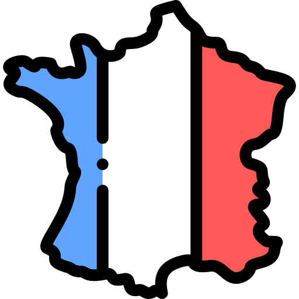

<!-- Set up my Github profile -->

  
  

  <strong>Hello, I'm Quentin,</strong> Engineer specialized in DataScience and Artificial Intelligence, from <b>Paris - France</b> .

  
  

 
 

  
### 🧐 More About Me:

 

- 🔭 &nbsp; I’m currently working on **AI projects**
- 🌱 &nbsp; I’m currently learning C++
- 👨🏻‍💻 &nbsp; Most of my projects are available on [Github](https://github.com/QuentinTech?tab=repositories)
- 💬 &nbsp; Ask me about anything tech related, I am happy to help
- 📫 &nbsp; Feel free to ping me on [LinkedIn](https://www.linkedin.com/in/quentin-barth%C3%A9l%C3%A9my-585534197/)
- 📚 &nbsp; When I am free, I read fantasy and fiction novels, or sport.

 
 

### 🔨 Languages and Tools:

 
 

<!-- 

 -->

 
 

### 📊 Github Stats

 
 

### 🛠️ My Projects

<table>
  <thead>
    <tr>
      <th width="35%">🎁 Projects</th>
      <th width="25%">⭐ Main language</th>
      <th width="40%">📚 Description</th>
    </tr>
  </thead>
  <tbody>
    <tr>
      <td><a href="https://github.com/QuentinTech/trapped-maze"><b>Mini game : Trapped maze</b></a></td>
      <td align="center">C++</td>
      <td>A small game to start programming in C++.</td>
    </tr>
  </tbody>
</table>

 
 

